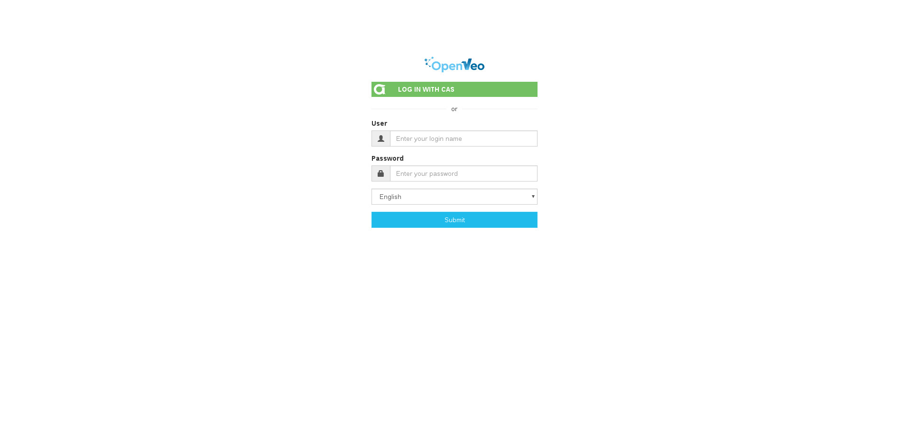
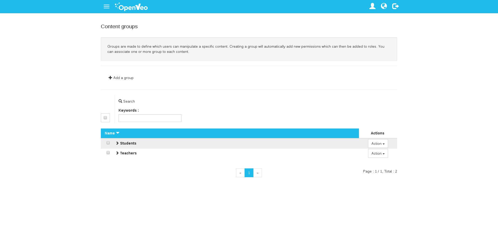
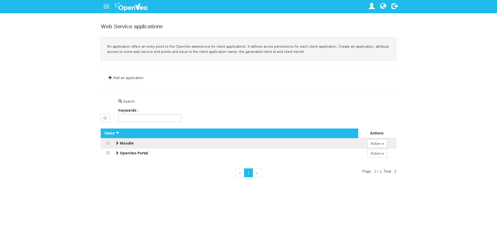

# What's OpenVeo ?

OpenVeo is a [Node.js](http://nodejs.org/) and [AngularJS](https://angularjs.org/) CMS. It embeds an HTTP server based on Express framework ([Express](https://www.npmjs.com/package/express)) and a plugin loader mechanism.

The core of the system (i.e. without any plugin) offers a simple connection form to the administration interface.

This interface gives access to a limited set of default features:

-  Users management
-  Permissions, roles and groups management
-  Web service management
-  A profile page

Each plugin brings zero to many additive administration pages and zero to many additive public pages.

## Compatibility

OpenVeo has been tested on the following operating systems :

- Windows 7
- Ubuntu 14.04
- Debian 8 (Jessy)

OpenVeo has been tested on the following  :

- Google Chrome 45
- Mozilla Firefox 40
- Opera 32
- Internet Explorer 11

## Screenshots

### Login page

### Back end home page

### Back end roles management page

### Back end users management page

### Back end groups management page

### Back end applications management page
